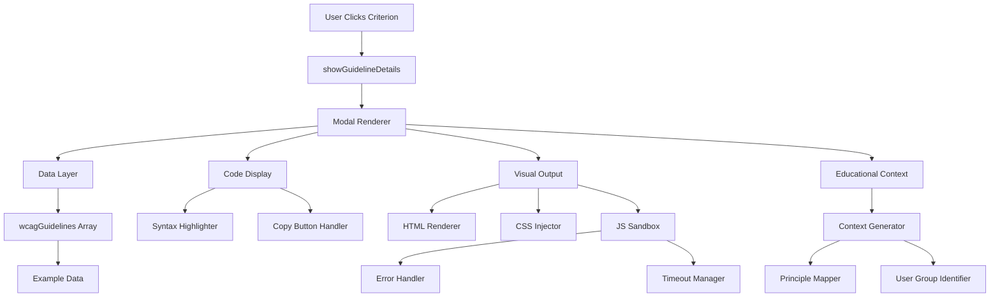

# Design Document: WCAG Complete Examples Modal

## Overview

This design extends the existing WCAG Success Criteria Details modal to include comprehensive before/after code examples with visual output rendering. The feature transforms the modal from a reference tool into an interactive learning platform where developers can see, understand, and copy accessibility implementation patterns.

### Design Goals

1. **Educational Excellence**: Provide clear, complete code examples that demonstrate the difference between inaccessible and accessible implementations
2. **Visual Learning**: Render live previews of code examples so users can see and interact with the results
3. **Developer Productivity**: Enable easy code copying and reuse through well-structured templates
4. **Performance**: Maintain fast modal load times through lazy loading and caching strategies
5. **Accessibility**: Ensure the modal itself exemplifies WCAG compliance
6. **Maintainability**: Integrate seamlessly with existing code structure and data models

### Key Features

- Side-by-side before/after code comparison with syntax highlighting
- Live visual output rendering with sandboxed JavaScript execution
- Interactive examples demonstrating keyboard navigation and focus management
- Educational context explaining accessibility barriers and solutions
- One-click code copying with clipboard API integration
- Responsive design supporting mobile and desktop viewports
- Comprehensive error handling for malformed or problematic code

## Architecture

### System Components



### Component Interaction Flow

1. **Modal Initialization**: User clicks a WCAG criterion, triggering `showGuidelineDetails(guideline)`
2. **Data Retrieval**: Function accesses guideline object containing before/after example data
3. **Content Assembly**: Modal body HTML is constructed with all sections including new example sections
4. **Lazy Rendering**: Visual output containers are created but rendering is deferred until scroll
5. **Syntax Highlighting**: Code examples are processed through `syntaxHighlightLine()` for colorization
6. **Event Binding**: Copy buttons, interactive examples, and skip links are wired up
7. **Modal Display**: Bootstrap modal instance is shown with focus management

### Integration Points

The feature integrates with existing code at these points:

- **showGuidelineDetails()**: Extended to include before/after sections in modal body HTML
- **wcagGuidelines array**: Extended with new properties for example data
- **syntaxHighlightLine()**: Reused for code colorization
- **escapeHtml()**: Reused for safe HTML rendering
- **Bootstrap Modal**: Existing modal structure and behavior preserved
- **CSS classes**: Existing Bootstrap and custom classes reused for consistency

## Components and Interfaces

### 1. Example Data Structure

Each guideline object in `wcagGuidelines` array is extended with:

```javascript
{
  id: "1.1.1",
  title: "Non-text Content",
  // ... existing properties ...
  
  // New properties for examples
  examples: {
    before: {
      html: "",
      css: "/* Optional CSS */",
      js: "// Optional JavaScript",
      context: "This image has no alt attribute, making it invisible to screen readers."
    },
    after: {
      html: "",
      css: "/* Optional CSS */",
      js: "// Optional JavaScript",
      context: "The alt attribute provides a text alternative that screen readers can announce."
    },
    interactive: {
      enabled: false,
      instructions: "Press Tab to navigate to the image."
    },
    userGroups: ["screen reader users", "users with images disabled"],
    principle: "Perceivable"
  }
}
```

### 2. Modal Section Structure

The new sections are inserted between "Simple Description" and "How to Implement in Future Projects":

```html
<section class="guideline-section mb-4" aria-labelledby="examples-heading">
  <h4 id="examples-heading" class="h6 fw-bold mb-3">Code Examples</h4>
  
  <!-- Skip Links -->
  <nav class="example-skip-links mb-3" aria-label="Jump to section">
    <a href="#before-example" class="btn btn-sm btn-outline-secondary">Before Example</a>
    <a href="#after-example" class="btn btn-sm btn-outline-secondary">After Example</a>
  </nav>
  
  <!-- Before/After Container -->
  <div class="examples-container">
    <!-- Before Example -->
    <article id="before-example" class="example-card before-example">
      <!-- Educational Context -->
      <div class="example-context alert alert-warning">
        <h5 class="h6 mb-2">❌ Inaccessible Implementation</h5>
        <p class="mb-2">[Context explaining the barrier]</p>
        <p class="mb-0 small">
          <strong>Principle:</strong> [Principle] | 
          <strong>Affects:</strong> [User groups]
        </p>
      </div>
      
      <!-- Code Display -->
      <div class="code-section">
        <div class="code-header">
          <span class="code-label">HTML</span>
          <button class="btn btn-sm btn-outline-primary copy-btn" 
                  data-copy-target="before-html"
                  aria-label="Copy HTML code">
            <i class="bi bi-clipboard"></i> Copy
          </button>
        </div>
        <pre class="code-block" id="before-html"><code>[Highlighted HTML]</code></pre>
      </div>
      
      <!-- Visual Output -->
      <div class="visual-output-section">
        <div class="visual-output-header">
          <span class="visual-output-label">Visual Output</span>
        </div>
        <div class="visual-output-container" data-render-target="before-visual">
          <!-- Rendered output injected here -->
        </div>
      </div>
    </article>
    
    <!-- After Example (similar structure) -->
    <article id="after-example" class="example-card after-example">
      <!-- Similar structure with success styling -->
    </article>
  </div>
  
  <!-- Interactive Instructions (if applicable) -->
  <div class="interactive-instructions alert alert-info">
    <i class="bi bi-keyboard"></i> [Instructions for testing]
  </div>
</section>
```

### 3. Visual Output Renderer

```javascript
function renderExampleVisualOutput(containerId, htmlCode, cssCode, jsCode, guideline) {
  const container = document.getElementById(containerId);
  if (!container) return;
  
  // Create isolated rendering context
  const iframe = document.createElement('iframe');
  iframe.className = 'visual-output-iframe';
  iframe.setAttribute('sandbox', 'allow-scripts allow-same-origin');
  iframe.setAttribute('title', `Visual output for ${guideline.id}`);
  
  container.innerHTML = '';
  container.appendChild(iframe);
  
  // Build complete HTML document
  const iframeDoc = iframe.contentDocument || iframe.contentWindow.document;
  const fullHtml = `
    <!DOCTYPE html>
    <html lang="en">
    <head>
      <meta charset="UTF-8">
      <meta name="viewport" content="width=device-width, initial-scale=1.0">
      <style>
        body { margin: 0; padding: 16px; font-family: system-ui, -apple-system, sans-serif; }
        ${cssCode || ''}
      </style>
    </head>
    <body>
      ${htmlCode}
      <script>
        try {
          ${jsCode || ''}
        } catch (error) {
          console.error('Example code error:', error);
          document.body.innerHTML += '<div style="color: red; padding: 8px; border: 1px solid red; margin-top: 8px;">JavaScript error: ' + error.message + '</div>';
        }
      </script>
    </body>
    </html>
  `;
  
  iframeDoc.open();
  iframeDoc.write(fullHtml);
  iframeDoc.close();
  
  // Set timeout for long-running scripts
  setTimeout(() => {
    if (iframe.contentWindow) {
      // Script execution timeout handling
    }
  }, 100);
}
```

### 4. Syntax Highlighter Extension

Extend existing `syntaxHighlightLine()` function to handle CSS and JavaScript:

```javascript
function syntaxHighlightCode(code, language) {
  const lines = code.split('\n');
  
  switch(language) {
    case 'html':
      return lines.map(line => syntaxHighlightLine(line)).join('\n');
    
    case 'css':
      return lines.map(line => syntaxHighlightCSSLine(line)).join('\n');
    
    case 'javascript':
      return lines.map(line => syntaxHighlightJSLine(line)).join('\n');
    
    default:
      return escapeHtml(code);
  }
}

function syntaxHighlightCSSLine(line) {
  let escaped = escapeHtml(line);
  
  // Selectors
  escaped = escaped.replace(/^(\s*)([.#]?[\w-]+)(\s*{)/g, 
    '$1<span class="css-selector">$2</span>$3');
  
  // Properties
  escaped = escaped.replace(/([\w-]+)(\s*:)/g, 
    '<span class="css-property">$1</span>$2');
  
  // Values
  escaped = escaped.replace(/:\s*([^;]+)(;?)/g, 
    ': <span class="css-value">$1</span>$2');
  
  return escaped;
}

function syntaxHighlightJSLine(line) {
  let escaped = escapeHtml(line);
  
  // Keywords
  const keywords = ['const', 'let', 'var', 'function', 'return', 'if', 'else', 'for', 'while', 'try', 'catch'];
  keywords.forEach(keyword => {
    escaped = escaped.replace(new RegExp(`\\b(${keyword})\\b`, 'g'), 
      '<span class="js-keyword">$1</span>');
  });
  
  // Strings
  escaped = escaped.replace(/(['"`])(.*?)\1/g, 
    '<span class="js-string">$1$2$1</span>');
  
  // Functions
  escaped = escaped.replace(/\b(\w+)(\s*\()/g, 
    '<span class="js-function">$1</span>$2');
  
  return escaped;
}
```

### 5. Copy Code Handler

```javascript
function setupCopyButtons() {
  document.querySelectorAll('.copy-btn').forEach(button => {
    button.addEventListener('click', async (e) => {
      const targetId = button.getAttribute('data-copy-target');
      const codeBlock = document.getElementById(targetId);
      
      if (!codeBlock) return;
      
      const code = codeBlock.textContent;
      
      try {
        await navigator.clipboard.writeText(code);
        showCopyConfirmation(button);
      } catch (error) {
        showCopyError(button);
        fallbackCopyMethod(codeBlock);
      }
    });
  });
}

function showCopyConfirmation(button) {
  const originalHTML = button.innerHTML;
  button.innerHTML = '<i class="bi bi-check"></i> Copied!';
  button.classList.add('btn-success');
  button.classList.remove('btn-outline-primary');
  
  setTimeout(() => {
    button.innerHTML = originalHTML;
    button.classList.remove('btn-success');
    button.classList.add('btn-outline-primary');
  }, 2000);
}

function fallbackCopyMethod(codeBlock) {
  const range = document.createRange();
  range.selectNodeContents(codeBlock);
  const selection = window.getSelection();
  selection.removeAllRanges();
  selection.addRange(range);
  
  alert('Code selected. Press Ctrl+C (Cmd+C on Mac) to copy.');
}
```

### 6. Lazy Loading Manager

```javascript
function setupLazyLoading() {
  const observer = new IntersectionObserver((entries) => {
    entries.forEach(entry => {
      if (entry.isIntersecting) {
        const container = entry.target;
        const renderTarget = container.getAttribute('data-render-target');
        const guideline = getCurrentGuideline();
        
        if (renderTarget && guideline.examples) {
          const isAfter = renderTarget.includes('after');
          const example = isAfter ? guideline.examples.after : guideline.examples.before;
          
          renderExampleVisualOutput(
            renderTarget,
            example.html,
            example.css,
            example.js,
            guideline
          );
          
          observer.unobserve(container);
        }
      }
    });
  }, {
    rootMargin: '50px'
  });
  
  document.querySelectorAll('.visual-output-container').forEach(container => {
    observer.observe(container);
  });
}
```

## Data Models

### Guideline Example Data Model

```typescript
interface GuidelineExample {
  before: CodeExample;
  after: CodeExample;
  interactive: InteractiveConfig;
  userGroups: string[];
  principle: 'Perceivable' | 'Operable' | 'Understandable' | 'Robust';
}

interface CodeExample {
  html: string;
  css?: string;
  js?: string;
  context: string;
}

interface InteractiveConfig {
  enabled: boolean;
  instructions?: string;
  keyboardTest?: boolean;
  focusTest?: boolean;
  ariaLiveTest?: boolean;
}
```

### Example Data Storage

Examples are stored in the `wcagGuidelines` array in `wcag-data.js`:

```javascript
const wcagGuidelines = [
  {
    id: "1.1.1",
    title: "Non-text Content",
    level: "A",
    principle: "Perceivable",
    // ... existing properties ...
    
    examples: {
      before: {
        html: ``,
        context: "This image lacks an alt attribute, making it completely inaccessible to screen reader users. They will only hear the filename, which provides no meaningful information about the image content."
      },
      after: {
        html: ``,
        context: "The alt attribute provides a descriptive text alternative that screen readers can announce, allowing users who cannot see the image to understand its content and purpose."
      },
      interactive: {
        enabled: false
      },
      userGroups: ["screen reader users", "users with images disabled", "users on slow connections"],
      principle: "Perceivable"
    }
  },
  // ... more guidelines
];
```

## 