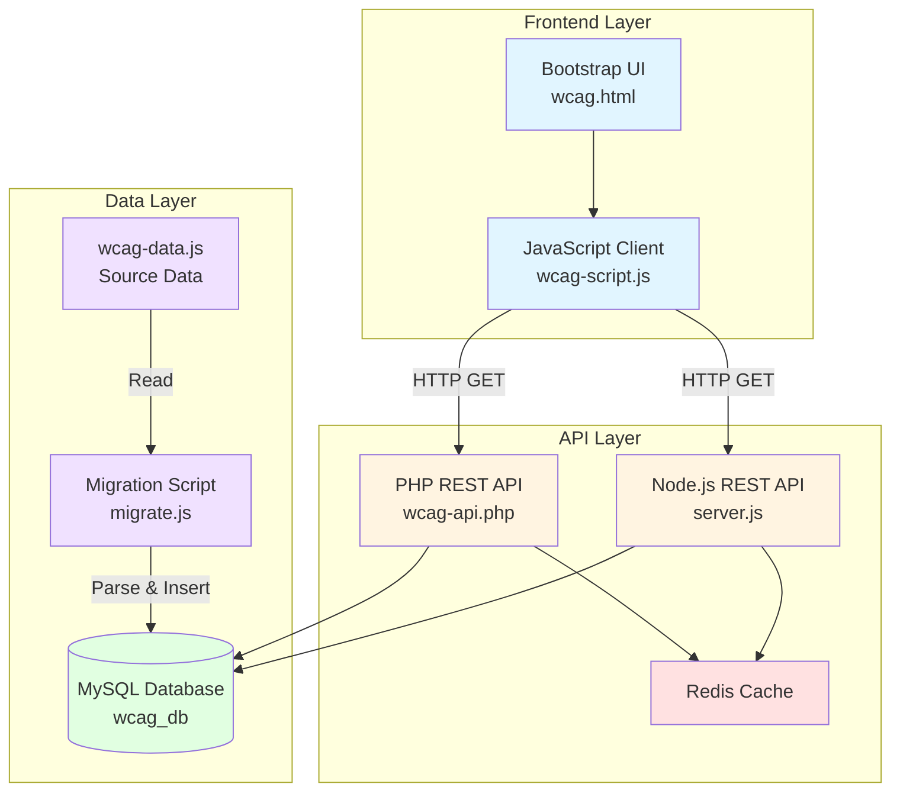

# Design Document: WCAG Database Migration System

## Overview

This design document specifies the architecture and implementation details for migrating the WCAG evaluation system from hardcoded JavaScript data (wcag-data.js) to a MySQL database with REST API. The system currently stores approximately 40 WCAG 2.1 success criteria with comprehensive information including principles, levels, descriptions, techniques, and before/after code examples.

The migration involves three major components:
1. **Database Layer**: Normalized MySQL schema storing WCAG criteria and related data
2. **API Layer**: REST API endpoints (PHP and Node.js implementations) serving data to clients
3. **Frontend Integration**: Refactored JavaScript client consuming API instead of hardcoded data

The design maintains backward compatibility with the existing UI/UX while enabling dynamic content management and improved scalability.

## Architecture

### System Architecture



### Data Flow

1. **Migration Phase**: Migration script reads wcag-data.js, validates data, and inserts into MySQL
2. **Runtime Phase**: Frontend requests data from API, API checks cache, queries database if needed, returns JSON
3. **Update Phase**: Content managers use API endpoints to create/update criteria, cache is invalidated

### Technology Stack

- **Database**: MySQL 5.7+ with InnoDB engine
- **Backend**: PHP 7.4+ (shared hosting) or Node.js 16+ (cloud platforms)
- **Caching**: Redis 6+ for API response caching
- **Frontend**: Vanilla JavaScript (ES6+), Bootstrap 5, Fetch API
- **Documentation**: OpenAPI 3.0 with Swagger UI
- **Deployment**: Docker for local development, Railway/Netlify for production

## Components and Interfaces

### Database Schema

#### Tables

**1. wcag_criteria**
```sql
CREATE TABLE wcag_criteria (
    id VARCHAR(10) PRIMARY KEY,
    principle ENUM('Perceivable', 'Operable', 'Understandable', 'Robust') NOT NULL,
    title VARCHAR(255) NOT NULL,
    level ENUM('A', 'AA', 'AAA') NOT NULL,
    description TEXT NOT NULL,
    explanation TEXT,
    created_at TIMESTAMP DEFAULT CURRENT_TIMESTAMP,
    updated_at TIMESTAMP DEFAULT CURRENT_TIMESTAMP ON UPDATE CURRENT_TIMESTAMP,
    INDEX idx_principle (principle),
    INDEX idx_level (level),
    INDEX idx_principle_level (principle, level)
) ENGINE=InnoDB DEFAULT CHARSET=utf8mb4 COLLATE=utf8mb4_unicode_ci;
```

**2. wcag_techniques**
```sql
CREATE TABLE wcag_techniques (
    id INT AUTO_INCREMENT PRIMARY KEY,
    criterion_id VARCHAR(10) NOT NULL,
    technique_code VARCHAR(20) NOT NULL,
    technique_description TEXT,
    FOREIGN KEY (criterion_id) REFERENCES wcag_criteria(id) ON DELETE CASCADE,
    INDEX idx_criterion (criterion_id)
) ENGINE=InnoDB DEFAULT CHARSET=utf8mb4 COLLATE=utf8mb4_unicode_ci;
```

**3. wcag_examples**
```sql
CREATE TABLE wcag_examples (
    id INT AUTO_INCREMENT PRIMARY KEY,
    criterion_id VARCHAR(10) NOT NULL,
    state ENUM('before', 'after') NOT NULL,
    html_code TEXT,
    css_code TEXT,
    js_code TEXT,
    context TEXT,
    FOREIGN KEY (criterion_id) REFERENCES wcag_criteria(id) ON DELETE CASCADE,
    INDEX idx_criterion_state (criterion_id, state)
) ENGINE=InnoDB DEFAULT CHARSET=utf8mb4 COLLATE=utf8mb4_unicode_ci;
```

**4. wcag_user_groups**
```sql
CREATE TABLE wcag_user_groups (
    id INT AUTO_INCREMENT PRIMARY KEY,
    criterion_id VARCHAR(10) NOT NULL,
    user_group VARCHAR(255) NOT NULL,
    FOREIGN KEY (criterion_id) REFERENCES wcag_criteria(id) ON DELETE CASCADE,
    INDEX idx_criterion (criterion_id)
) ENGINE=InnoDB DEFAULT CHARSET=utf8mb4 COLLATE=utf8mb4_unicode_ci;
```

**5. wcag_key_summaries**
```sql
CREATE TABLE wcag_key_summaries (
    id INT AUTO_INCREMENT PRIMARY KEY,
    criterion_id VARCHAR(10) NOT NULL,
    summary_text TEXT NOT NULL,
    display_order INT DEFAULT 0,
    FOREIGN KEY (criterion_id) REFERENCES wcag_criteria(id) ON DELETE CASCADE,
    INDEX idx_criterion (criterion_id)
) ENGINE=InnoDB DEFAULT CHARSET=utf8mb4 COLLATE=utf8mb4_unicode_ci;
```

**6. wcag_interactive_config**
```sql
CREATE TABLE wcag_interactive_config (
    criterion_id VARCHAR(10) PRIMARY KEY,
    enabled BOOLEAN DEFAULT FALSE,
    FOREIGN KEY (criterion_id) REFERENCES wcag_criteria(id) ON DELETE CASCADE
) ENGINE=InnoDB DEFAULT CHARSET=utf8mb4 COLLATE=utf8mb4_unicode_ci;
```

### REST API Endpoints

#### Base URL
- PHP: `https://api.example.com/wcag/v1`
- Node.js: `https://api.example.com/wcag/v1`

#### Endpoints

**1. GET /criteria**
- Description: Retrieve all WCAG criteria with optional filtering
- Query Parameters:
  - `principle` (optional): Filter by principle (Perceivable, Operable, Understandable, Robust)
  - `level` (optional): Filter by level (A, AA, AAA)
  - `limit` (optional): Number of results per page (default: 50, max: 100)
  - `offset` (optional): Pagination offset (default: 0)
- Response: 200 OK
```json
{
  "success": true,
  "data": [
    {
      "id": "1.1.1",
      "principle": "Perceivable",
      "title": "Non-text Content",
      "level": "A",
      "description": "All non-text content...",
      "explanation": "Images must have...",
      "techniques": ["G94", "G95", "ARIA6"],
      "userGroups": ["screen reader users", "users with images disabled"],
      "keySummary": ["Provide alt text for images", "..."]
    }
  ],
  "meta": {
    "total": 40,
    "limit": 50,
    "offset": 0
  }
}
```

**2. GET /criteria/:id**
- Description: Retrieve a single WCAG criterion with complete details
- Path Parameters:
  - `id`: WCAG criterion ID (e.g., "1.1.1")
- Response: 200 OK
```json
{
  "success": true,
  "data": {
    "id": "1.1.1",
    "principle": "Perceivable",
    "title": "Non-text Content",
    "level": "A",
    "description": "All non-text content...",
    "explanation": "Images must have...",
    "techniques": [
      {"code": "G94", "description": "Providing short text alternative..."}
    ],
    "examples": {
      "before": {
        "html": "",
        "css": "",
        "js": "",
        "context": "This image has no alt text..."
      },
      "after": {
        "html": "",
        "css": "",
        "js": "",
        "context": "The image now has descriptive alt text..."
      },
      "interactive": {
        "enabled": false
      }
    },
    "userGroups": ["screen reader users", "users with images disabled"],
    "keySummary": ["Provide alt text for images", "..."]
  }
}
```

**3. POST /criteria** (Protected)
- Description: Create a new WCAG criterion
- Authentication: Required (JWT token)
- Request Body:
```json
{
  "id": "1.1.1",
  "principle": "Perceivable",
  "title": "Non-text Content",
  "level": "A",
  "description": "All non-text content...",
  "explanation": "Images must have...",
  "techniques": ["G94", "G95"],
  "examples": {...},
  "userGroups": ["screen reader users"],
  "keySummary": ["Provide alt text"]
}
```
- Response: 201 Created

**4. PUT /criteria/:id** (Protected)
- Description: Update an existing WCAG criterion
- Authentication: Required (JWT token)
- Request Body: Same as POST
- Response: 200 OK

**5. DELETE /criteria/:id** (Protected)
- Description: Delete a WCAG criterion
- Authentication: Required (JWT token)
- Response: 204 No Content

**6. GET /health**
- Description: Health check endpoint
- Response: 200 OK
```json
{
  "status": "healthy",
  "database": "connected",
  "cache": "connected",
  "timestamp": "2024-01-15T10:30:00Z"
}
```

### Frontend API Client

#### API Service Module (wcag-api-service.js)

```javascript
class WCAGApiService {
  constructor(baseUrl) {
    this.baseUrl = baseUrl;
    this.cache = new Map();
    this.cacheExpiry = 3600000; // 1 hour
  }

  async fetchCriteria(filters = {}) {
    const cacheKey = JSON.stringify(filters);
    const cached = this.cache.get(cacheKey);
    
    if (cached && Date.now() - cached.timestamp < this.cacheExpiry) {
      return cached.data;
    }

    const queryString = new URLSearchParams(filters).toString();
    const url = `${this.baseUrl}/criteria${queryString ? '?' + queryString : ''}`;
    
    const response = await fetch(url, {
      headers: {
        'Accept': 'application/json'
      }
    });

    if (!response.ok) {
      throw new Error(`API error: ${response.status}`);
    }

    const data = await response.json();
    this.cache.set(cacheKey, { data, timestamp: Date.now() });
    return data;
  }

  async fetchCriterionById(id) {
    const cacheKey = `criterion_${id}`;
    const cached = this.cache.get(cacheKey);
    
    if (cached && Date.now() - cached.timestamp < this.cacheExpiry) {
      return cached.data;
    }

    const response = await fetch(`${this.baseUrl}/criteria/${id}`, {
      headers: {
        'Accept': 'application/json'
      }
    });

    if (!response.ok) {
      if (response.status === 404) {
        throw new Error(`Criterion ${id} not found`);
      }
      throw new Error(`API error: ${response.status}`);
    }

    const data = await response.json();
    this.cache.set(cacheKey, { data, timestamp: Date.now() });
    return data;
  }

  clearCache() {
    this.cache.clear();
  }
}
```

### Migration Script

#### migrate.js (Node.js)

```javascript
const fs = require('fs');
const mysql = require('mysql2/promise');

class WCAGMigration {
  constructor(dbConfig) {
    this.dbConfig = dbConfig;
    this.connection = null;
    this.stats = {
      criteria: 0,
      techniques: 0,
      examples: 0,
      userGroups: 0,
      keySummaries: 0,
      errors: []
    };
  }

  async connect() {
    this.connection = await mysql.createConnection(this.dbConfig);
  }

  async migrate(sourceFile) {
    console.log('Starting migration...');
    
    // Read and parse source data
    const sourceData = this.loadSourceData(sourceFile);
    
    // Validate data
    this.validateData(sourceData);
    
    // Begin transaction
    await this.connection.beginTransaction();
    
    try {
      for (const criterion of sourceData) {
        await this.migrateCriterion(criterion);
      }
      
      await this.connection.commit();
      console.log('Migration completed successfully');
      this.printStats();
    } catch (error) {
      await this.connection.rollback();
      console.error('Migration failed:', error);
      throw error;
    }
  }

  loadSourceData(sourceFile) {
    const content = fs.readFileSync(sourceFile, 'utf8');
    // Extract wcagGuidelines array from JavaScript file
    const match = content.match(/const wcagGuidelines = (\[[\s\S]*?\]);/);
    if (!match) {
      throw new Error('Could not find wcagGuidelines array in source file');
    }
    return JSON.parse(match[1]);
  }

  validateData(data) {
    const validPrinciples = ['Perceivable', 'Operable', 'Understandable', 'Robust'];
    const validLevels = ['A', 'AA', 'AAA'];
    
    for (const criterion of data) {
      if (!criterion.id || !criterion.principle || !criterion.title || !criterion.level) {
        throw new Error(`Invalid criterion: missing required fields`);
      }
      if (!validPrinciples.includes(criterion.principle)) {
        throw new Error(`Invalid principle: ${criterion.principle}`);
      }
      if (!validLevels.includes(criterion.level)) {
        throw new Error(`Invalid level: ${criterion.level}`);
      }
    }
  }

  async migrateCriterion(criterion) {
    // Insert main criterion
    await this.connection.execute(
      `INSERT INTO wcag_criteria (id, principle, title, level, description, explanation)
       VALUES (?, ?, ?, ?, ?, ?)`,
      [criterion.id, criterion.principle, criterion.title, criterion.level, 
       criterion.description, criterion.explanation]
    );
    this.stats.criteria++;

    // Insert techniques
    if (criterion.techniques && Array.isArray(criterion.techniques)) {
      for (const technique of criterion.techniques) {
        await this.connection.execute(
          `INSERT INTO wcag_techniques (criterion_id, technique_code)
           VALUES (?, ?)`,
          [criterion.id, technique]
        );
        this.stats.techniques++;
      }
    }

    // Insert examples
    if (criterion.examples) {
      if (criterion.examples.before) {
        await this.insertExample(criterion.id, 'before', criterion.examples.before);
      }
      if (criterion.examples.after) {
        await this.insertExample(criterion.id, 'after', criterion.examples.after);
      }
      if (criterion.examples.interactive) {
        await this.connection.execute(
          `INSERT INTO wcag_interactive_config (criterion_id, enabled)
           VALUES (?, ?)`,
          [criterion.id, criterion.examples.interactive.enabled || false]
        );
      }
    }

    // Insert user groups
    if (criterion.examples && criterion.examples.userGroups) {
      for (const group of criterion.examples.userGroups) {
        await this.connection.execute(
          `INSERT INTO wcag_user_groups (criterion_id, user_group)
           VALUES (?, ?)`,
          [criterion.id, group]
        );
        this.stats.userGroups++;
      }
    }

    // Insert key summaries
    if (criterion.examples && criterion.examples.keySummary) {
      for (let i = 0; i < criterion.examples.keySummary.length; i++) {
        await this.connection.execute(
          `INSERT INTO wcag_key_summaries (criterion_id, summary_text, display_order)
           VALUES (?, ?, ?)`,
          [criterion.id, criterion.examples.keySummary[i], i]
        );
        this.stats.keySummaries++;
      }
    }
  }

  async insertExample(criterionId, state, example) {
    await this.connection.execute(
      `INSERT INTO wcag_examples (criterion_id, state, html_code, css_code, js_code, context)
       VALUES (?, ?, ?, ?, ?, ?)`,
      [criterionId, state, example.html || '', example.css || '', 
       example.js || '', example.context || '']
    );
    this.stats.examples++;
  }

  printStats() {
    console.log('\nMigration Statistics:');
    console.log(`- Criteria: ${this.stats.criteria}`);
    console.log(`- Techniques: ${this.stats.techniques}`);
    console.log(`- Examples: ${this.stats.examples}`);
    console.log(`- User Groups: ${this.stats.userGroups}`);
    console.log(`- Key Summaries: ${this.stats.keySummaries}`);
    if (this.stats.errors.length > 0) {
      console.log(`- Errors: ${this.stats.errors.length}`);
    }
  }
}
```

## Data Models

### Criterion Model

```javascript
class WCAGCriterion {
  constructor(data) {
    this.id = data.id;                    // e.g., "1.1.1"
    this.principle = data.principle;      // Perceivable, Operable, Understandable, Robust
    this.title = data.title;              // e.g., "Non-text Content"
    this.level = data.level;              // A, AA, AAA
    this.description = data.description;  // Full description text
    this.explanation = data.explanation;  // Additional explanation
    this.techniques = data.techniques;    // Array of technique objects
    this.examples = data.examples;        // Before/after examples
    this.userGroups = data.userGroups;    // Affected user groups
    this.keySummary = data.keySummary;    // Key points array
  }

  validate() {
    const validPrinciples = ['Perceivable', 'Operable', 'Understandable', 'Robust'];
    const validLevels = ['A', 'AA', 'AAA'];
    
    if (!this.id || !/^\d+\.\d+\.\d+$/.test(this.id)) {
      throw new Error('Invalid criterion ID format');
    }
    if (!validPrinciples.includes(this.principle)) {
      throw new Error('Invalid principle');
    }
    if (!validLevels.includes(this.level)) {
      throw new Error('Invalid level');
    }
    if (!this.title || this.title.length === 0) {
      throw new Error('Title is required');
    }
    if (!this.description || this.description.length === 0) {
      throw new Error('Description is required');
    }
  }

  toJSON() {
    return {
      id: this.id,
      principle: this.principle,
      title: this.title,
      level: this.level,
      description: this.description,
      explanation: this.explanation,
      techniques: this.techniques,
      examples: this.examples,
      userGroups: this.userGroups,
      keySummary: this.keySummary
    };
  }
}
```

### Example Model

```javascript
class CodeExample {
  constructor(data) {
    this.html = data.html || '';
    this.css = data.css || '';
    this.js = data.js || '';
    this.context = data.context || '';
  }

  validate() {
    if (!this.html && !this.css && !this.js) {
      throw new Error('Example must contain at least one code snippet');
    }
  }

  toJSON() {
    return {
      html: this.html,
      css: this.css,
      js: this.js,
      context: this.context
    };
  }
}
```

## Error Handling

### API Error Responses

All API errors follow a consistent format:

```json
{
  "success": false,
  "error": {
    "code": "VALIDATION_ERROR",
    "message": "Invalid input data",
    "details": {
      "field": "principle",
      "issue": "Must be one of: Perceivable, Operable, Understandable, Robust"
    }
  }
}
```

### Error Codes

- `VALIDATION_ERROR` (400): Invalid input data
- `NOT_FOUND` (404): Resource not found
- `UNAUTHORIZED` (401): Authentication required
- `FORBIDDEN` (403): Insufficient permissions
- `RATE_LIMIT_EXCEEDED` (429): Too many requests
- `INTERNAL_ERROR` (500): Server error
- `DATABASE_ERROR` (500): Database connection or query error
- `CACHE_ERROR` (500): Cache service error

### Frontend Error Handling

```javascript
class APIErrorHandler {
  static handle(error, context) {
    console.error(`API Error in ${context}:`, error);
    
    if (error.message.includes('404')) {
      return {
        userMessage: 'The requested content was not found.',
        retry: false
      };
    }
    
    if (error.message.includes('429')) {
      return {
        userMessage: 'Too many requests. Please wait a moment and try again.',
        retry: true,
        retryAfter: 60000 // 1 minute
      };
    }
    
    if (error.message.includes('500')) {
      return {
        userMessage: 'Server error. Please try again later.',
        retry: true,
        retryAfter: 5000 // 5 seconds
      };
    }
    
    return {
      userMessage: 'An unexpected error occurred. Please refresh the page.',
      retry: true,
      retryAfter: 3000
    };
  }
}
```

### Database Error Handling

```php
class DatabaseErrorHandler {
    public static function handle(\Exception $e, string $context): array {
        error_log("Database error in {$context}: " . $e->getMessage());
        
        if ($e->getCode() === '23000') {
            // Integrity constraint violation
            return [
                'code' => 'DUPLICATE_ENTRY',
                'message' => 'A criterion with this ID already exists',
                'httpStatus' => 409
            ];
        }
        
        if ($e->getCode() === '42S02') {
            // Table doesn't exist
            return [
                'code' => 'DATABASE_ERROR',
                'message' => 'Database schema not initialized',
                'httpStatus' => 500
            ];
        }
        
        return [
            'code' => 'DATABASE_ERROR',
            'message' => 'A database error occurred',
            'httpStatus' => 500
        ];
    }
}
```

## Testing Strategy

This feature involves database schema design, data migration, API development, and frontend integration. Property-based testing is not applicable for this type of infrastructure and integration work. Instead, the testing strategy focuses on:

### Unit Tests

- **Database Models**: Test CRUD operations for each table
- **Validation Logic**: Test input validation for API endpoints
- **Data Transformation**: Test JSON serialization/deserialization
- **Error Handling**: Test error response formatting

Example unit tests:
- Test that WCAGCriterion.validate() rejects invalid principle values
- Test that CodeExample.validate() requires at least one code snippet
- Test that API error responses follow the correct format
- Test that database queries use parameterized statements

### Integration Tests

- **API Endpoints**: Test all CRUD operations end-to-end
- **Database Operations**: Test foreign key constraints and cascading deletes
- **Cache Integration**: Test Redis caching behavior
- **Authentication**: Test JWT token validation for protected endpoints

Example integration tests:
- Test GET /criteria returns all criteria with correct structure
- Test POST /criteria creates a new criterion and related records
- Test DELETE /criteria/:id removes criterion and cascades to related tables
- Test API returns cached responses on subsequent requests

### Migration Tests

- **Data Integrity**: Verify migrated data matches source data
- **Idempotency**: Verify migration can run multiple times safely
- **Validation**: Test migration rejects invalid source data
- **Rollback**: Test transaction rollback on errors

Example migration tests:
- Test migration script successfully parses wcag-data.js
- Test all 40 criteria are migrated with complete data
- Test migration fails gracefully with invalid data
- Test running migration twice doesn't create duplicates

### End-to-End Tests

- **Frontend Integration**: Test complete user workflows
- **Performance**: Test API response times meet requirements
- **Error Scenarios**: Test frontend handles API errors gracefully
- **Browser Compatibility**: Test in Chrome, Firefox, Safari, Edge

Example E2E tests:
- Test user can load WCAG guidelines page and see all criteria
- Test user can filter criteria by principle and level
- Test user can view detailed criterion with examples
- Test page displays error message when API is unavailable

### Security Tests

- **SQL Injection**: Test parameterized queries prevent injection
- **XSS Prevention**: Test input sanitization
- **Rate Limiting**: Test API enforces rate limits
- **Authentication**: Test protected endpoints require valid tokens

Example security tests:
- Test API rejects SQL injection attempts in query parameters
- Test API sanitizes HTML in user-provided content
- Test API returns 429 after exceeding rate limit
- Test API returns 401 for requests without authentication

### Performance Tests

- **Response Time**: Verify API meets latency requirements
- **Concurrent Requests**: Test API handles multiple simultaneous requests
- **Cache Effectiveness**: Measure cache hit rates
- **Database Query Performance**: Test query execution times

Example performance tests:
- Test GET /criteria responds within 200ms
- Test GET /criteria/:id responds within 100ms
- Test API handles 100 concurrent requests without errors
- Test cache reduces database queries by 80%

### Test Coverage Goals

- Unit tests: 80% code coverage minimum
- Integration tests: All API endpoints covered
- Migration tests: All data transformation paths covered
- E2E tests: All critical user workflows covered
- Security tests: All OWASP Top 10 vulnerabilities tested

### Testing Tools

- **Unit Testing**: Jest (Node.js), PHPUnit (PHP)
- **Integration Testing**: Supertest (Node.js), Guzzle (PHP)
- **E2E Testing**: Playwright or Cypress
- **Performance Testing**: Apache JMeter or k6
- **Security Testing**: OWASP ZAP, SQLMap

### Continuous Integration

All tests should run automatically on:
- Pull request creation
- Merge to main branch
- Scheduled nightly builds

CI pipeline should:
1. Run unit tests
2. Run integration tests with test database
3. Run security scans
4. Generate coverage reports
5. Fail build if coverage drops below 80%

---

This design provides a comprehensive architecture for migrating the WCAG evaluation system from hardcoded JavaScript to a database-backed REST API while maintaining backward compatibility and enabling future extensibility.
